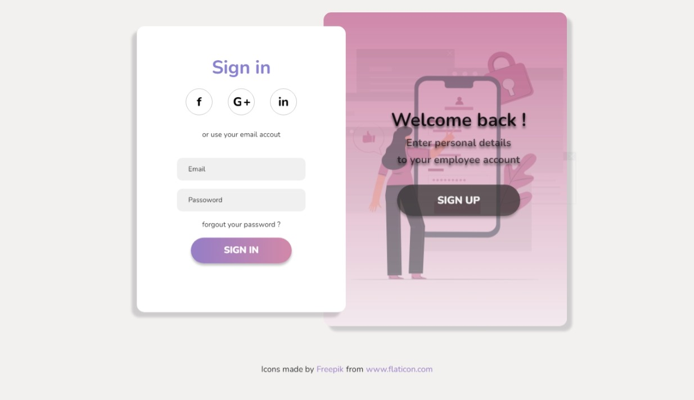

# Página de Login

Esta aplicação se trata de uma página de login feita com HTML5 e CSS3. O projeto ainda há 
espaço para novas funcionalidades, mas por hora cumpriu o seu obejtivo.

<h3>Objetivo </h3>

Treinar minhas habilidades de desenvolvimento Front-End.

<h3>Resultado </h3>

 

#

Você pode visualizar melhor o resultado realizando o dowloand do projeto e executando na sua máquina. 
Após baixar o projeto, basta ir até a pasta que você realizou o download e abrir o arquivo .html 
no navegador de sua preferência.

